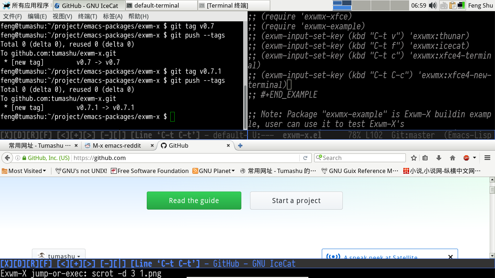
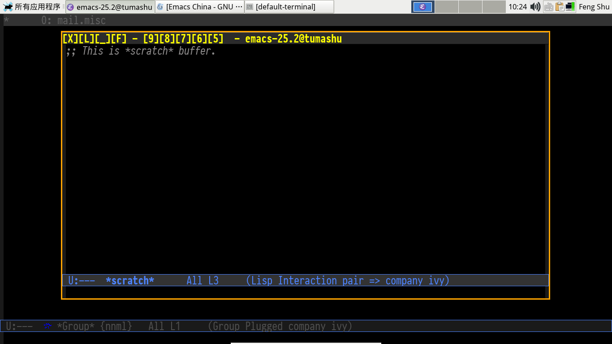

- [Exwm-X](#orgd646811)
  - [What is Exwm-X](#org8acfee4)
  - [Showcase](#orgc56c0d6)
  - [Feature](#org3d9bebd)
    - [Appconfig](#org12c8b60)
    - [Buttons](#orga86bf78)
    - [Easy move/resize](#org08c1c46)
    - [Jump-or-exec](#org5ad0e6c)
    - [Dmenu](#org9672e27)
    - [Sendstring](#org5e21123)
    - [Others](#org52d17c5)
  - [Install](#orgb140e48)
  - [Configure](#org696e5a9)
    - [Add exwm-x directory to emacs's load-path](#org8bb3b1f)
    - [Edit "~/.initrc" file or "~/.xsession" file](#org3ceb3f8)
    - [Make "~/.initrc" or "~/.xsession" excutable](#orgccd1308)
    - [Edit "~/.exwm-x"](#org05c5226)
  - [Usage](#org121dc43)
    - [Build appconfig database](#org275ecc9)
    - [The usage of "exwmx-example"](#orga837630)

# Exwm-X

## What is Exwm-X

Exwm-X is a derivative window manager based on EXWM (emacs x window manager), which focus on Mouse-Control-People.

## Showcase

1.  Tilling windows

    

2.  Floating windows

    

## Feature

### Appconfig

\`exwmx-appconfig' is a database manager, which is used to record and manage appconfigs (an appconfig is a plist of application's information), when run command \`exwmx-appconfig', a buffer with appconfig-template will be poped up, user can edit the template and run \`exwmx-appconfig-finish' to save the change or run \`exwmx-appconfig-ignore' to ignore the change.

All appconfigs will be saved into file: \`exwmx-appconfig-file'.

By default, every appconfig have the following keys:

1.  :command

    Record the shell command of application.

2.  :alias

    Define alias of an application, this key is used by \`exwmx-jump-or-exec'.

3.  :pretty-name

    In EXWM and Exwm-X, an application is assocated with an emacs buffer, user can set the buffer's name with :pretty-name.

4.  :paste-key

    Record the paste keybinding of an application, this key is used by \`exwmx-sendstring'.

5.  :class

    Record the application's class, this key is used by \`exwmx-jump-or-exec'.

6.  :instance

    Record the application's instance, this key is used by \`exwmx-jump-or-exec'.

7.  :title

    Record the application's title, this key is used by \`exwmx-jump-or-exec'.

8.  :floating

    If set it to \`t', application will floating when launched.

9.  :add-prefix-keys

    Add a key to \`exwm-input-prefix-keys' of application.

10. :remove-prefix-keys

    Remove a key from \`exwm-input-prefix-keys' of application, if set it to \`t', all keys in \`exwm-input-prefix-keys' will be removed.

11. :ignore-simulation-keys

    Ingore simulation keys of application.

12. :eval

    Evaluation a expression when launch an application.

### Buttons

Exwm-X add the following **buttons** to mode-line, user can click them to operate application's window:

1.  [X]: Delete the current application.
2.  [D]: Delete the current emacs window.
3.  [F]: Toggle floating/tilling window.
4.  [<]: Move window border to left.
5.  [+]: Maximize the current window.
6.  [>]: Move window border to right.
7.  [-]: Split window horizontal.
8.  [|]: Split window vertical.
9.  [\_]: minumize floating application
10. [Line 'XXXX'] or [L]: line-mode
11. [Char 'XXXX'] or [C]: Char-mode
12. [←][↑][↓][→]: Resize the floating window of application.

Note: user can use mode-line as the button-line of floating window:

    (setq exwmx-button-floating-button-line 'mode-line)

### Easy move/resize

By default, EXWM use "s-'down-mouse-1'" to move a floating-window and "s-'down-mouse-3'" to resize a floating-window.

When Exwm-X is enabled, user can drag **title showed in button-line** to move a floating-window. and click [←][↑][↓][→] in button-line to resize a floating-window, **without press WIN key**.

Note: button-line is mode-line or header-line of emacs.

### Jump-or-exec

If the application's window is found, jump to this window, otherwise, launch the application with command.

1.  Common usage

        (exwmx-jump-or-exec "firefox")

    Note: \`exwmx-jump-or-exec' **need** appconfigs stored in \`exwmx-appconfig-file', user should store appconfigs of frequently used applications by yourself with the help of \`exwmx-appconfig'.

2.  Define an alias

    Search an appconfig which :alias is "web-browser", and run this appconfig's :command.

        (exwmx-jump-or-exec "web-browser" nil t)

### Dmenu

\`exwmx-dmenu' let user input or select (with the help of ivy) a command in minibuffer, and execute it.

\`exwmx-dmenu' support some command prefixes:

1.  ",command": run "command" in terminal emulator, for example, ",top" will execute a terminal emulator, then run shell command: "top" .

    Note: user can change terminal emulator by variable \`exwmx-terminal-emulator'.

2.  ";command": run an emacs command which name is exwmx:"command".
3.  "-Num1Num2": split window top-to-bottom, for example, the result of command "-32" is: 3 windows on top and 2 windows in buttom.
4.  "|Num1Num2": split window left-to-right, for example, the result of command "|32" is: 3 windows at left and 2 window at right.

User can customize the prefixes of \`exwmx-dmenu' with the help of \`exwmx-dmenu-prefix-setting'.

### Sendstring

\`exwmx-sendstring' let user send a string to application, it is a simple tool but very useful, for example:

1.  Find a Unicode character then search it to with google.
2.  Input Chinese without install ibus, fcitx or other external input method, just use emacs's buildin input method, for example: chinese-pyim, chinese-py, a good emergency tools :-)
3.  Write three line emacs-lisp example and send it to github.
4.  Draw an ascii table with table.el and send it to BBC.
5.  &#x2026;&#x2026;

when run \`exwmx-sendstring', a buffer will be poped up to let user edit. after run command \`exwmx-sendstring-finish', the content of the buffer will be sent to the input field of current application.

\`exwmx-sendstring-from-minibuffer' is a simple version of \`exwmx-sendstring', it use minibuffer to get input.

\`exwmx-sendstring-from-kill-ring' can select a string in kill-ring then send this string to application.

\`exwmx-sendstring&#x2013;send' can send a string to application, it is used by elisp.

NOTE: if \`exwmx-sendstring' can not work well with an application, user should set :paste-key of this application with the help of \`exwmx-appconfig'.

### Others

1.  \`exwmx-shell-command': run a shell command.
2.  \`exwmx-shell-command-interactively': run a shell command interactively.

## Install

1.  Config melpa repository, please see：<http://melpa.org/#/getting-started>
2.  M-x package-install RET exwm-x RET

## Configure

### Add exwm-x directory to emacs's load-path

Pasting the below line to "~/.emacs" is a simple way.

    (add-to-list 'load-path "/path/to/exwm-x")

### Edit "~/.initrc" file or "~/.xsession" file

You should edit "~/.initrc" file or "~/.xsession" file like below example:

    # Fallback cursor
    # xsetroot -cursor_name left_ptr

    # Keyboard repeat rate
    # xset r rate 200 60

    xhost +SI:localuser:$USER

    exec dbus-launch --exit-with-session emacs --eval '(require (quote exwmx-loader))'

### Make "~/.initrc" or "~/.xsession" excutable

    chmod a+x ~/.xsession

or

    chmod a+x ~/.initrc

### Edit "~/.exwm-x"

Add your exwm config to this file, for example:

    (require 'exwm)
    (require 'exwm-x)
    (require 'exwmx-xfce)
    (require 'exwmx-example)
    (exwm-input-set-key (kbd "C-t v") 'exwmx:file-browser)
    (exwm-input-set-key (kbd "C-t f") 'exwmx:web-browser)
    (exwm-input-set-key (kbd "C-t e") 'exwmx:emacs)
    (exwm-input-set-key (kbd "C-t c") 'exwmx-xfce-terminal)
    (exwm-input-set-key (kbd "C-t z") 'exwmx-floating-hide-all)
    (exwm-input-set-key (kbd "C-t C-c") 'exwmx-xfce-new-terminal)

    (exwm-input-set-key (kbd "C-t C-f") 'exwm-floating-toggle-floating)

## Usage

### Build appconfig database

When user **first** login in Exwm-X desktop environment, appconfigs of frequently used applications should be added to appconfig database file: \`exwmx-appconfig-file', it is simple but **very very** important, for many useful commands of Exwm-X need this database file, for example: \`exwmx-jump-or-exec', \`exwmx-sendstring' and so on.

user should do like the below:

1.  Launch an application with \`exwmx-dmenu'.
2.  Run command \`exwmx-appconfig'.
3.  Edit appconfig template
4.  Save
5.  Launch another application with \`exwmx-dmenu'.
6.  &#x2026;&#x2026;.

### The usage of "exwmx-example"

"exwmx-example" is Exwm-X buildin example, user can use it to test Exwm-X's features, the following is its keybindings. by the way, Exwm-X is a Exwm derivative, most Exwm commands can be used too :-)

| Key       | command                         |
|--------- |------------------------------- |
| "C-t ;"   | exwmx-dmenu                     |
| "C-t C-e" | exwmx-sendstring                |
| "C-t C-r" | exwmx-appconfig                 |
| "C-t 1"   | exwmx-switch-to-1-workspace     |
| "C-t 2"   | exwmx-switch-to-2-workspace     |
| "C-t 3"   | exwmx-switch-to-3-workspace     |
| "C-t 4"   | exwmx-switch-to-4-workspace     |
| "C-x o"   | switch-window                   |
| "C-c y"   | exwmx-sendstring-from-kill-ring |

If exwmx-example doesn't suit for your need, just copy and paste its useful pieces to your "~/.exwm-x" file.

Converted from exwm-x.el by [el2org](https://github.com/tumashu/el2org) .